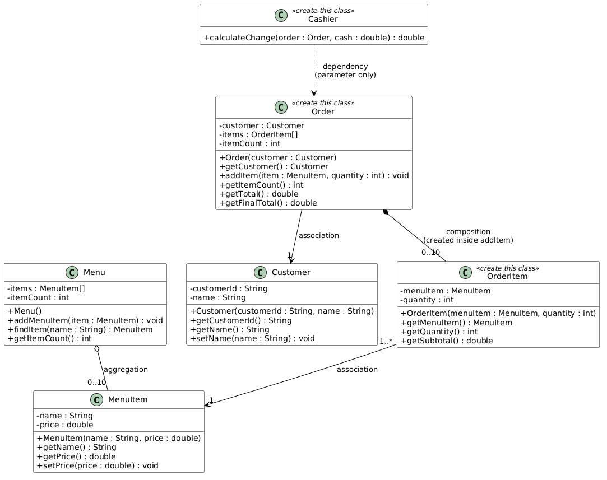

# OOP Practice Quiz — Cafe Cashier (POS)

🇮🇩 Versi Bahasa Indonesia: [README.id.md](README.id.md)

## Case Study

You are building the core of a simple **cafe cashier (point-of-sale) application**:

- The cafe has a **menu** containing food and drink items.
- A **customer** places an **order** containing one or more menu items with a quantity.
- Orders of **Rp 100,000 or more** get a **10% discount**.
- The **cashier** receives cash and calculates the change.

This quiz covers four OOP concepts: **class**, **object**, **encapsulation**, and **class relations** (association, aggregation, composition, dependency).

## Class Diagram



Classes marked **«create this class»** do not exist yet — you must create them yourself.

### The 4 Class Relations in This Project

| Relation | Where | Meaning here |
|---|---|---|
| **Association** | `OrderItem → MenuItem`, `Order → Customer` | The object holds a reference to another object that lives on its own. |
| **Aggregation** | `Menu ◇→ MenuItem` | `Menu` collects `MenuItem` objects that are **created outside** and passed in; they can exist without the menu. |
| **Composition** | `Order ◆→ OrderItem` | `Order` **creates its own** `OrderItem` objects inside `addItem(...)`; they cannot exist without the order. |
| **Dependency** | `Cashier ⇢ Order` | `Cashier` only **uses** an `Order` as a method parameter; it never stores it in a field. |

## Part 1 — Complete the Skeleton Classes

These files already exist in `src/main/java/id/ac/polinema/oop/`. Replace every `throw new UnsupportedOperationException(...)` with a working implementation. **Use plain arrays — do NOT use `List`/`ArrayList`** (Collections are next meeting's topic).

### `MenuItem`

| Field | Type | Visibility |
|---|---|---|
| name | String | private |
| price | double | private |

| Member | Description |
|---|---|
| `MenuItem(String name, double price)` | Stores both parameters into the fields. |
| `getName()` / `getPrice()` | Return the field values. |
| `setPrice(double price)` | Updates the price. A **negative** price throws `IllegalArgumentException` and leaves the old price unchanged. |

### `Customer`

| Field | Type | Visibility |
|---|---|---|
| customerId | String | private |
| name | String | private |

| Member | Description |
|---|---|
| `Customer(String customerId, String name)` | Stores both parameters into the fields. |
| `getCustomerId()` / `getName()` | Return the field values. |
| `setName(String name)` | Updates the name. A **null or blank** name throws `IllegalArgumentException` and leaves the old name unchanged. |

### `Menu` *(aggregation of MenuItem)*

| Field | Type | Visibility |
|---|---|---|
| items | MenuItem[] (capacity **10**) | private |
| itemCount | int | private |

| Member | Description |
|---|---|
| `Menu()` | Initializes the array (capacity 10) and the counter (0). |
| `addMenuItem(MenuItem item)` | Stores the item at index `itemCount`, then increments the counter. When the menu is already full (10 items), does nothing. |
| `findItem(String name)` | Returns the `MenuItem` with the exact same name, or `null` when not found. |
| `getItemCount()` | Returns how many items are stored. |

## Part 2 — Create the New Classes

These files do **not** exist. Create them in `src/main/java/id/ac/polinema/oop/` exactly as specified in the class diagram.

### `OrderItem` *(association to MenuItem)*

One line of an order: a menu item plus a quantity.

| Field | Type | Visibility |
|---|---|---|
| menuItem | MenuItem | private |
| quantity | int | private |

| Member | Description |
|---|---|
| `OrderItem(MenuItem menuItem, int quantity)` | Stores both parameters into the fields. |
| `getMenuItem()` / `getQuantity()` | Return the field values. |
| `getSubtotal()` | Returns `price × quantity` (type `double`). |

### `Order` *(composition of OrderItem, association to Customer)*

| Field | Type | Visibility |
|---|---|---|
| customer | Customer | private |
| items | OrderItem[] (capacity **10**) | private |
| itemCount | int | private |

| Member | Description |
|---|---|
| `Order(Customer customer)` | Stores the customer, initializes the array (capacity 10) and the counter (0). |
| `getCustomer()` | Returns the customer. |
| `addItem(MenuItem item, int quantity)` | **Creates a new `OrderItem` inside this method** (this is the composition!), stores it at index `itemCount`, then increments the counter. When the order is full (10 lines), does nothing. |
| `getItemCount()` | Returns how many order lines are stored. |
| `getTotal()` | Returns the sum of every order line's subtotal (`double`). |
| `getFinalTotal()` | Returns the payable amount: when `getTotal() >= 100000`, apply a **10% discount** (`total × 0.9`); otherwise return the total unchanged. |

### `Cashier` *(dependency on Order)*

No fields. `Order` is only used as a **parameter** — never store it in a field.

| Member | Description |
|---|---|
| `calculateChange(Order order, double cash)` | Returns `cash - order.getFinalTotal()`. When the cash is **less than** the final total, throws `IllegalArgumentException`. |

## How It Works

1. Accept the assignment and clone your repository from GitHub Classroom.
2. Complete the skeleton classes (Part 1) and create the new classes (Part 2).
3. Test locally:
   ```bash
   mvn test
   ```
   Run a single test group, e.g.:
   ```bash
   mvn test -Dtest=MenuItemConstructorTest
   ```
4. Commit and push. Every push automatically triggers autograding; scores appear in the repository's **Actions** tab and on the GitHub Classroom dashboard.

Tip: work in the grading-table order below — the points are small and incremental, so every step you finish is immediately reflected in your score.

## Try the App Manually

`Main.java` is a free playground (not graded). After finishing all classes, write your demo there, for example:

```java
public static void main(String[] args) {
    Menu menu = new Menu();
    menu.addMenuItem(new MenuItem("Es Kopi Susu", 18000));
    menu.addMenuItem(new MenuItem("Roti Bakar", 12000));

    Customer budi = new Customer("C001", "Budi Santoso");
    Order order = new Order(budi);
    order.addItem(menu.findItem("Es Kopi Susu"), 2);
    order.addItem(menu.findItem("Roti Bakar"), 1);

    Cashier cashier = new Cashier();
    double cash = 50000;

    System.out.println("Customer : " + order.getCustomer().getName());
    System.out.println("Total    : " + order.getTotal());
    System.out.println("Payable  : " + order.getFinalTotal());
    System.out.println("Cash     : " + cash);
    System.out.println("Change   : " + cashier.calculateChange(order, cash));
}
```

Run it:

```bash
mvn -q compile exec:java
```

Expected output:

```
Customer : Budi Santoso
Total    : 48000.0
Payable  : 48000.0
Cash     : 50000.0
Change   : 2000.0
```

## Grading

Total **100 points**, split across 12 small test groups (run via GitHub Actions):

| # | Test Group | Concept | Points |
|---|---|---|---|
| 1 | MenuItem Constructor Test | class & object | 5 |
| 2 | MenuItem Getter Test | class & object | 5 |
| 3 | MenuItem Encapsulation Test | encapsulation | 10 |
| 4 | Customer Test | encapsulation | 10 |
| 5 | Menu Aggregation Test | aggregation | 10 |
| 6 | OrderItem Class Structure Test | new class, association | 10 |
| 7 | OrderItem Subtotal Test | object behavior | 5 |
| 8 | Order Class Structure Test | new class, association | 10 |
| 9 | Order Add Item Test | composition | 10 |
| 10 | Order Total Test | relation traversal | 10 |
| 11 | Order Discount Test | business logic | 5 |
| 12 | Cashier Test | dependency | 10 |
| | **Total** | | **100** |

## Rules

- **Do not modify** any files under `src/test/**` or `.github/**`.
- Do not change class names, field names, method names, or method signatures — the autograder uses them exactly as specified.
- All fields must be `private` (this is checked by the tests).
- Use plain arrays only — no `List`, `ArrayList`, or any other Collection.
